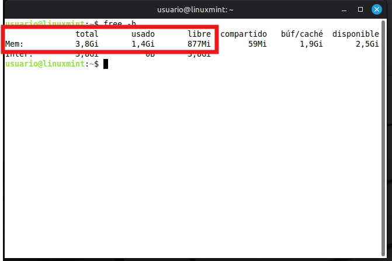
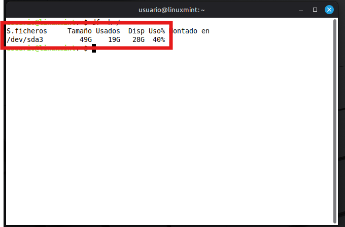
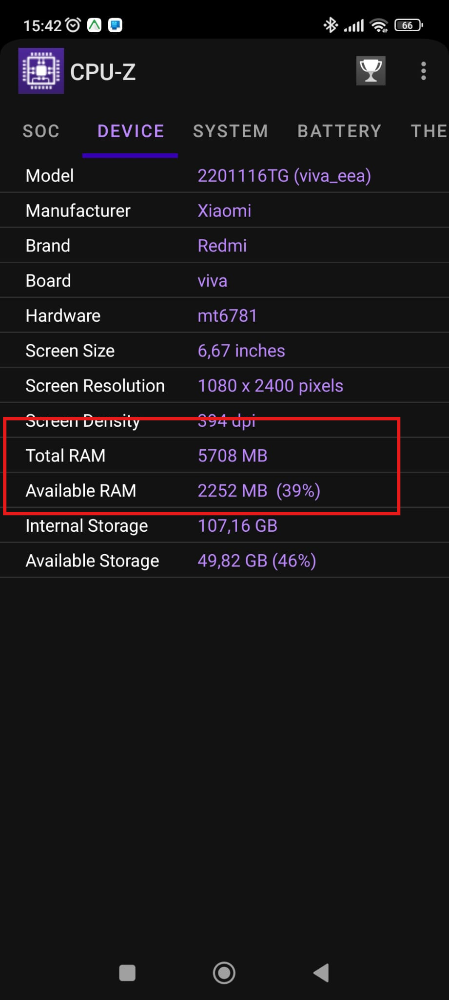
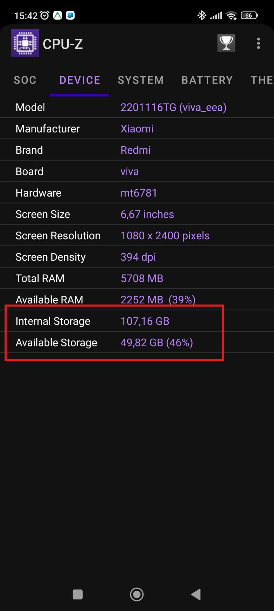

# Hardware
## Memoria RAM vs almacenamiento
**Digitalización · 4.º ESO**

  <a href="../presentaciones-html/04-ram-almacenamiento.html">Abrir presentación</a>

---

## Dos memorias con trabajos distintos
- **RAM:** mesa de trabajo rápida para lo que se está usando.
- **Almacenamiento:** archivador que conserva programas y archivos.
- Al abrir una aplicación, sus datos pasan del almacenamiento a la RAM.
- Analogía: trabajar con un libro abierto frente a guardarlo en la estantería.

---

## RAM: rápida, volátil, pequeña y cara
- Es **rápida** pues puede trabajar con la CPU.
  - Trabaja con con la información que está procesando la CPU.
- Es **volátil**: al apagar, su contenido desaparece.
- Es **pequeña** en comparacion con el almacenamiento.
  - Normalmente hoy día entre 8 y 32 GB.
- Es **carísima** con respecto al almacenamiento.
- Tener más RAM facilita mantener más aplicaciones y pestañas abiertas a la vez.

---

## Almacenamiento

- Es **lenta** pues no puede trabajar con la CPU.
- Es **no volátil**: al apagar, contenido se mantiene.
- Más capacidad facilita mantener más aplicaciones y pestañas abiertas.
- Es **grande** en comparacion con la RAM.
  - Normalmente hoy día más de 1TB o 2TB. Cada terabyte son 1024 GB.
- Es **barata** con respecto a la memoria RAM.
- Tener más almacenamiento implica guardar más archivos de forma permanente.

---

## Almacenamiento interno y externo

**Almacenamiento interno**. El que está dentro del dispositivo.

- Discos duros
- Unidades SSD
- Tarjetas SD

**Almacenamiento externo**. El que está fuera del dispositivo. 

- Pendrives USB
- CD-ROM
- DVD
- Blueray

---

## Almacenamiento interno HDD: archivo con piezas móviles
- Guarda datos magnéticamente en platos giratorios.
- Suele ofrecer mucha capacidad a bajo coste.
- Es útil para archivos voluminosos que no necesitan abrirse constantemente.
- Es el más lento y el más barato.

---

## Almacenamiento interno SSD: acceso sin movimiento
- Usa memoria flash y no tiene partes móviles.
- Ofrece menos capacidad que un disco HDD y es más caro, pero es más rápido.
- Adecuado para sistema, juegos y uso cotidiano.

---

## Almacenamiento interno SSD: formatos actuales

Almacenamiento interno para ordenadores.

### SSD clásicos
- Son los discos duros rectangulares.

### SSD M.2
- Son discos duros que parecen una barrita de chicle.

---

## Qué guardar en cada lugar
- RAM: pestañas abiertas, documentos en edición y datos de aplicaciones.
- SSD: sistema operativo, programas y proyectos que se usan a diario.
- HDD: grandes cantidades de datos que no se usen mucho: películas, fotos.

---

## Práctica 1

Vamos a ver la memoria RAM que tiene nuestro ordenador Linux Mint.

1. En Linux Mint abre **Terminal** desde el menú.
2. Ejecuta `free -h` y pulsa Intro.
3. En la fila `Mem` dice:
   1. `total`: indica la cantidad de memoria RAM total.
   2. `usado`: indica la cantidad de memoria RAM que se está utilizando ahora mismo.
   3. `libre`: indica la cantidad de memoria RAM que queda libre.
4. Haz una captura legible donde aparezcan la orden y su resultado.
5. Guarda y entrega el archivo como **`ejercicio1.jpg`**.

---

## Práctica 2

Vamos a ver la cantidad de almacenamiento interno que tiene nuestro ordenador Linux Mint.

1. Abre **Terminal** en Linux Mint.
2. Ejecuta `df -h /` para consultar el almacenamiento del sistema de archivos raíz.
3. Tenemos una fila que dice:
   1. `Tamaño`: cantidad en gigabytes del almacenamiento interno.
   2. `Usados`: cantidad en gigabytes utilizandos del almacenamiento interno.
   3. `Dis`: cantidad en gigabytes disponibles, es decir, libres.
   4. `Uso %`: porcentaje del uso del almacenamiento interno..
4. Haz una captura legible donde aparezcan la orden y su resultado.
5. Guarda y entrega el archivo como **`ejercicio2.jpg`**. 

---

## Práctica 3
1. Abre **CPU-Z** en el teléfono y entra en la pestaña **System** o **Memory** (el nombre puede variar según la versión).
2. Localiza la memoria RAM total y la disponible/libre; si aparece, anota también la usada.
3. Haz una captura de pantalla donde se lean la aplicación y esos valores, sin notificaciones ni datos personales.
4. Guarda y entrega la imagen como **`ejercicio3.jpg`**. 

**iPhone**

Quien tiene iPhone tiene que buscar en CPU-Z la sección donde pone **Memory**. Y se entrega una captura de pantalla de eso.

---

## Práctica 4 
1. En **CPU-Z**, abre **System** o **Device** y busca el bloque de almacenamiento interno (`Storage`), con capacidad total y espacio libre/usado.
2. Si tu versión no muestra el almacenamiento, consulta **Ajustes > Almacenamiento**; no instales otra aplicación.
3. Captura la pantalla donde se entiendan el total y el espacio disponible/usado. Oculta notificaciones o información personal.
4. Guarda y entrega la imagen como **`ejercicio4.jpg`**.

**iPhone**

Quien tiene iPhone tiene que buscar en CPU-Z la sección donde pone **Storage**. Y se entrega una captura de pantalla de eso.

