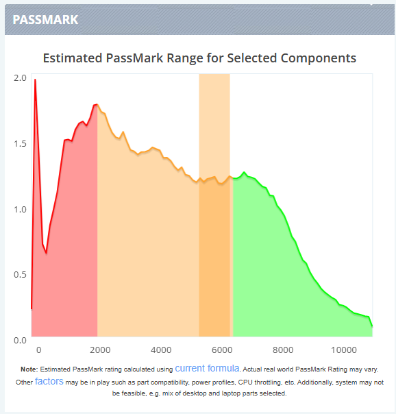
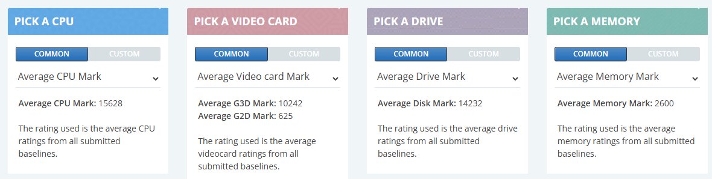
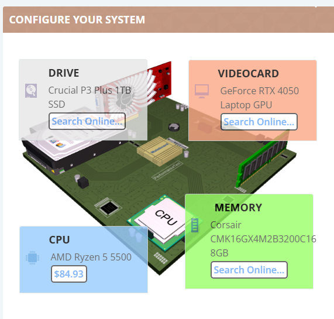
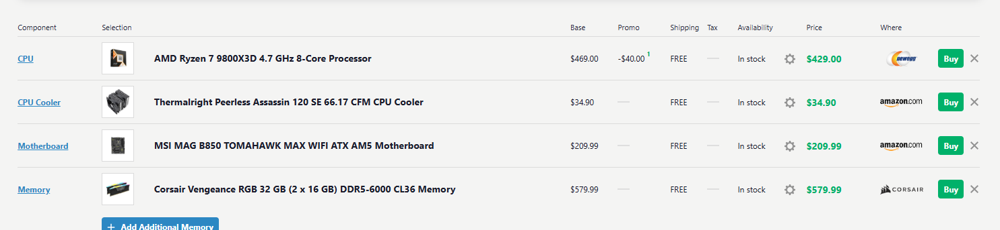

# Presupuesto de ordenadores

Vamos a construir tres ordenadores para tres tipos de usuarios diferentes:

- Una persona que quiere un ordenador solo para navegar por internet y poco más.
- Alguien que necesita hacer los deberes de Digitalización y de vez en cuando jugar.
- Una persona que quiere jugar a los últimos juegos.

Vamos a utilizar dos páginas web:

1. [PC Benchmark Builder](https://www.pcbenchmarks.net/builder.php)
2. [PcPartPicker](https://pcpartpicker.com/list/)

## PC Benchmark Builder

En la página de [PC Benchmark Builder](https://www.pcbenchmarks.net/builder.php) vemos que abajo a la derecha hay una gráfica que nos indica la puntuación estimada de la configuración que vamos a elegir.

Hay tres colores:

- Rojo: puntuación baja para ordenadores simples.
- Naranja: puntuación media para ordenadores potentes.
- Verde: punutación media para ordenadores de gaming.

En esta otra parte de la página puedes elegir elementos que hemos visto en clase que forman parte de un ordenador:

- CPU
- Video card o tarjeta gráfica dedicada
- Drive o almacenamiento interno
- Memory o memoria RAM

Según eliges las opciones, estas van apareciendo en el dibujo de una tarjeta gráfica:

Volviendo a la gráfica, fíjate que existe una columna que se colorea. Esta banda estima en qué lugar debería estar la configuración de elementos que has elegido previamente.

## PcPartPicker

En esta otra web [PcPartPicker](https://pcpartpicker.com/list/) podemos elegir todos los elementos que componen un ordenador buscando precios reales.

## ¿Qué hay que hacer?

Elige tres configuraciones de componentes de ordenador en PC Benchark, haciendo que cada configuración quede su estimación de benchmark en rojo, naranja y verde.

Después elige los componentes seleccionados y haz tres presupuesto diferentes con PC Part Picker.

