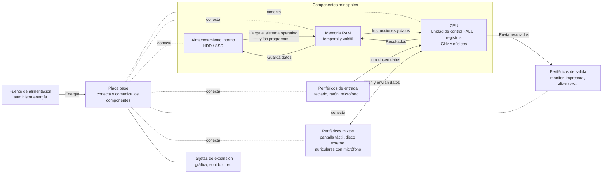

# Resumen

[Resumen](https://docs.google.com/document/d/1SKIJAAeMoscY5Wl-xKxZSoIelWqoCoP3pvEHs2hwjpU)

## Preguntas para repasar

- ¿Qué función cumple la memoria RAM en un ordenador?
- ¿Por qué la CPU necesita la RAM para trabajar con los datos?
- Nombra tres periféricos de entrada y tres de salida.
- ¿Cuál es la diferencia entre un disco duro (HDD) y una unidad SSD?
- ¿Qué papel tiene el sistema operativo en el funcionamiento del ordenador?
