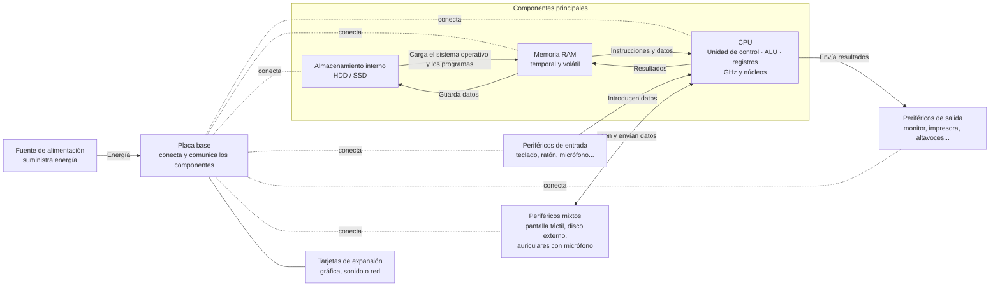

1. Componentes principales de un ordenador
1.1 La CPU (Unidad Central de Procesamiento)
La CPU, también conocida como procesador, es el "cerebro" del ordenador. Su función principal es ejecutar instrucciones, es decir, realizar cálculos y tomar decisiones basadas en los datos que recibe. Está formada por:
Unidad de control: dirige el flujo de datos entre los componentes.
Unidad aritmético-lógica (ALU): realiza operaciones matemáticas y lógicas.
Registros: pequeñas memorias internas que almacenan datos temporales.
La velocidad de la CPU se mide en gigahercios (GHz), y su rendimiento depende también del número de núcleos que tenga (cada núcleo puede ejecutar tareas de forma independiente).
1.2 La memoria RAM (Memoria de Acceso Aleatorio)
La RAM es una memoria volátil, lo que significa que pierde su contenido cuando se apaga el ordenador. Su función es almacenar temporalmente los datos y programas que la CPU necesita mientras trabaja. Cuanta más RAM tenga un ordenador, más tareas podrá realizar al mismo tiempo sin ralentizarse.
Por ejemplo, cuando abres un navegador web, el programa se carga desde el almacenamiento interno a la RAM, y desde ahí la CPU lo ejecuta.
1.3 El almacenamiento interno
El almacenamiento interno es donde se guardan los datos de forma permanente. Existen dos tipos principales:
Discos duros (HDD): utilizan platos magnéticos giratorios. Son más baratos pero más lentos.
Unidades de estado sólido (SSD): no tienen partes móviles y son mucho más rápidas.
Aquí se almacenan el sistema operativo, los programas, documentos, fotos, vídeos, etc. Cuando se enciende el ordenador, el sistema operativo se carga desde el almacenamiento a la RAM para que la CPU lo pueda ejecutar.
2. Relación entre CPU, RAM y almacenamiento
Estos tres componentes trabajan juntos de forma coordinada:
Inicio: Al encender el ordenador, la CPU busca el sistema operativo en el almacenamiento interno.
Carga: El sistema operativo se transfiere a la RAM.
Ejecución: La CPU toma instrucciones desde la RAM y las ejecuta.
Interacción: Si el usuario abre un archivo, la CPU lo carga desde el almacenamiento a la RAM para poder trabajar con él.
Este ciclo se repite constantemente. La CPU no puede acceder directamente al almacenamiento interno porque es demasiado lento; por eso necesita la RAM como intermediaria rápida.
3. Periféricos de entrada
Los periféricos de entrada permiten al usuario introducir datos en el ordenador. Algunos ejemplos son:
Teclado: permite escribir texto y comandos.
Ratón: facilita la navegación por la interfaz gráfica.
Micrófono: capta sonido para grabaciones o videollamadas.
Escáner: digitaliza documentos físicos.
Cámara web: captura imágenes y vídeo.
Estos dispositivos envían datos a la CPU, que los procesa y responde según el programa que esté en uso.
4. Periféricos de salida
Los periféricos de salida muestran los resultados del procesamiento realizado por el ordenador. Algunos ejemplos son:
Pantalla o monitor: muestra la interfaz gráfica, vídeos, documentos, etc.
Impresora: convierte documentos digitales en papel.
Altavoces: reproducen sonido.
Proyector: muestra contenido en una superficie externa.
La CPU envía los datos procesados a estos dispositivos para que el usuario los pueda ver, escuchar o imprimir.
5. Periféricos mixtos
Algunos periféricos pueden actuar como entrada y salida:
Pantallas táctiles: permiten ver contenido y también interactuar tocando.
Discos externos: permiten guardar y leer datos.
Auriculares con micrófono: permiten escuchar y hablar.
6. Otros componentes importantes
6.1 Placa base
Es el circuito principal donde se conectan todos los componentes. Permite que la CPU, la RAM, el almacenamiento y los periféricos se comuniquen entre sí.
6.2 Fuente de alimentación
Convierte la corriente eléctrica en energía adecuada para los componentes del ordenador.
6.3 Tarjetas de expansión
Algunos ordenadores incluyen tarjetas gráficas, de sonido o de red para mejorar sus capacidades.

7. Esquema resumen

Preguntas para repasar
¿Qué función cumple la memoria RAM en un ordenador?
¿Por qué la CPU necesita la RAM para trabajar con los datos?
Nombra tres periféricos de entrada y tres de salida.
¿Cuál es la diferencia entre un disco duro (HDD) y una unidad SSD?
¿Qué papel tiene el sistema operativo en el funcionamiento del ordenador?
