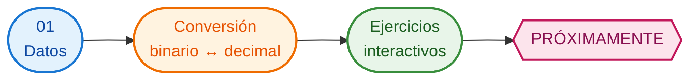

# Binario

!!! info "Contenido en construcción"
	Esta sección se está preparando. Próximamente encontrarás una explicación visual y actividades para convertir números entre los sistemas decimal y binario.

